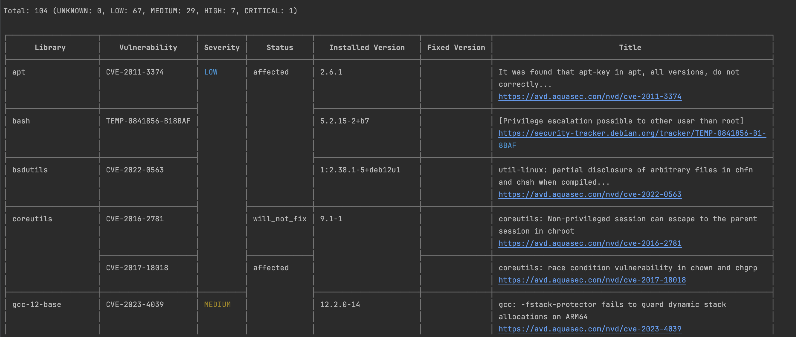
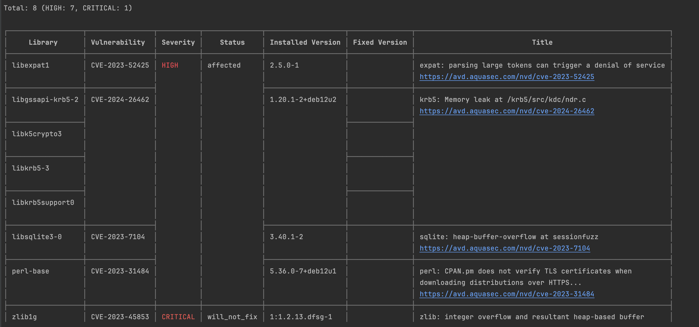

# Platform Engineer Case study

Please note that I did not have time to implement unit tests to check the written code. Normally I would create unit tests using pytest and a step in the CICD to do unit testing as well.

## Part 1
In order to ensure that the program works well for you please install the requirements listed in `requirements.txt` or use docker to test the program.

In this part I created a python script called `url_link_extractor.py` to extract links from a list of urls. 
You can use the program by executing `python url_link_extractor.py -u "https://news.ycombinator.com/" -o "stdout"`.

There were some ambiguities for me when it comes to this task:
* I was not sure if we only want to extract suburls corresponding to the given url, or if we also want to extract external links: The program that I coded extracts all links that are found in the given URLs
* I'm not sure if the output must be sorted or not. I used a set to keep deduplicated links therefore the outputs might not be sorted.

## Part 2

The Dockerfile can be found under the `Dockerfile` file:
* You can use `docker build -t mydocker .` to build the dockerfile
* You can then run `docker run -it mydocker -u "https://news.ycombinator.com" -o stdout` to test the image
* I used `trivy` to scan the image for vulnerabilities:
  * Trivy will analyze the layers of the Docker image and compare the installed packages and libraries against its vulnerability database. It will then provide a report highlighting any known vulnerabilities found.
  * We get the following result 
  * The scan will show us which package is responsible for the vulnerability, the severity of each vulnerability, the reason of the vulnerability (in `Title`) and the version of the package that fixes the issue if it exists:
    * In this case I had a high vulnerability due to an old version of setuptools that I resolved by installing the new version in the requirements file.
    * We have 7 High and 1 Critical vulnerabilities that come from the base image :
      * We need to be aware of the vulnerabilities that we have to see if they can pause potential security threats or bugs.
      * We can look for an alternative base image that resolves the vulnerabilities if they pose a threat for our application.
* I packaged the app in a kubernetes `Pod` (we can also go for a `Deployment` but `pod` seemed more appropriate in this case)
  * you can use `kubectl apply -f ./kubernetes/pod.yaml` (I did not test this)
